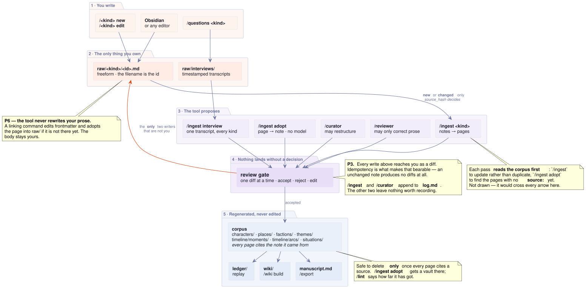

# How litfire works

Everything in litfire is markdown on disk. What makes it a tool rather than a
folder is that the files are in three layers, and each layer has exactly one
writer.

```
raw/        you write this
corpus/     the tool derives this from raw/
wiki/       built from the corpus, for reading
```

Open the vault in Obsidian and you will see all three. Only the first is yours.

## The three layers

### `raw/` — everything you write

Ten folders, one per kind of thing:

```
raw/
  arcs/  artifacts/  chapters/  characters/  factions/
  moments/  places/  situations/  systems/  themes/
  interviews/
```

Notes here are **freeform**. Headings, bullets, a wall of prose — there is no
format to learn and no schema to satisfy. This is a perfectly good note:

```markdown
Common Name: Linh Tran
Place of Origin: Singapore

Buddhist moral framework, non-dual. Forgiving, compassionate, intuitive.
When it comes to the world she sees it as "all one" — which is exactly
the thing that makes her useless in an argument with Sebastian.
```

One rule, and it is the only one: **the filename is the id.**
`raw/characters/linh-tran.md` becomes the character `linh-tran`. That is what
lets a scene say `characters: [linh-tran]` and have it mean something.

The tool never edits this folder. Two commands may _propose_ into it —
`/curator`, when the error is in the record itself, and `/ingest adopt` — and
both reach you as a diff first.

### `corpus/` — what the tool derives

The same ten folders, with the same names. A page here is the typed version of
your note: parsed frontmatter, resolved ids, cross-references the checks can
verify.

```markdown
---
id: linh-tran
name: Linh Tran
source: raw/characters/linh-tran.md
source_hash: 9f2a1c…
---

Buddhist moral framework, non-dual…
```

Those last two fields are the whole trick. `source` says which note this came
from; `source_hash` says what that note said at the time. Together they mean
`/ingest` can tell, without calling a model, whether a note has anything new to
say — so re-running it over an unchanged vault costs nothing at all.

**You should not hand-edit pages here.** Not because anything stops you, but
because they are regenerated: your edit survives until the next ingest and then
quietly does not. The commands that look like they edit the corpus don't —
see [Editing without thinking about layers](#editing-without-thinking-about-layers).

### `wiki/` — the reading view

Built by `/wiki build`, browsable with `/wiki serve`. Every page cross-linked,
every character's appearances listed, every moment's scenes gathered. Delete the
whole folder and rebuild it; nothing is lost, because nothing originates here.

`ledger/` is the same kind of thing: replayed state and open questions,
recomputed on every load.

## The flow



In words, for one character:

1. **You write** `raw/characters/linh-tran.md` — in Obsidian, in the native
   buffer via `/character` commands, or by answering `/questions character`.
2. **`/ingest character`** reads it and proposes a typed page.
3. **You accept the diff.** Nothing lands without that (see
   [the review gate](./review-gate.md)).
4. **`corpus/characters/linh-tran.md`** now exists, citing the note it came
   from.
5. **`/wiki build`** turns the corpus into a cross-linked wiki, and replay turns
   it into `ledger/state.md`.

Steps 2 and 3 are the only place a model is involved, and step 3 is the only
place anything reaches disk without you having typed it.

## The two ways in

There is no wrong order. Some people write everything down first; some prefer
being asked.

**Write it yourself.** Put a note in `raw/<kind>/` — any editor, or Obsidian,
or the native buffer — and run `/ingest <kind>`. Good when you already know the
answer and just want it in the system.

**Be interviewed.** `/questions <kind>` interviews you about that kind, opening
on whatever the checks have found unresolved. Answers land in
`raw/interviews/`, and `/ingest interview` files them across every kind the
conversation touched. Good when you know there is something there and have not
worked out what.

Both end in the same place: a note in `raw/`, a diff you accept, a page in the
corpus.

## Editing without thinking about layers

You mostly should not have to know which layer you are in. When you run:

```
/moment the-breach at 2036-08-15
/situation sit-001 cast linh-tran
/place oz-farm name The Farm
```

…the tool edits **your note in `raw/`**, and if the page existed only in the
corpus it copies it into `raw/` first and tells you so:

```
adopted into raw/moments/the-breach.md — your copy lives there now
```

That is called adopting, and it means a vault written before any of this
migrates by being used — one page at a time, on the pages you are actually
working on. A vault can sit half-moved indefinitely.

The derived page is brought along in the same breath, without a model call.
Setting `at:` on a moment is a copy, not an inference: you said the number, and
asking a model to make your own typed edit visible would be silly.

## Why the corpus is not a duplicate

This trips people up, so it is worth saying plainly: `corpus/` is **not** a
second copy of `raw/`. It is a different representation with different
guarantees — `raw/` is freeform and unvalidated, the corpus is typed, linked,
and checkable. It is `src/` and `dist/`, not two copies of `src/`.

Which means the corpus is safe to delete **only once every page cites a
source**. `/ingest adopt` gets a vault there, writing the note each authored
page should have had; `/lint` tells you how far along you are. Until then, a
corpus page with no `source:` is the only copy of something and deleting it
loses it.

## What to read next

- [Creating primitives](./creating-primitives.md) — the ten kinds, and three
  ways to make one
- [Writing a scene](./writing-a-scene.md) — the native buffer
- [Populating a situation](./populating-a-situation.md) — linking a scene to
  the world so it reaches the ledger
- [The review gate](./review-gate.md) — how a diff reaches you
